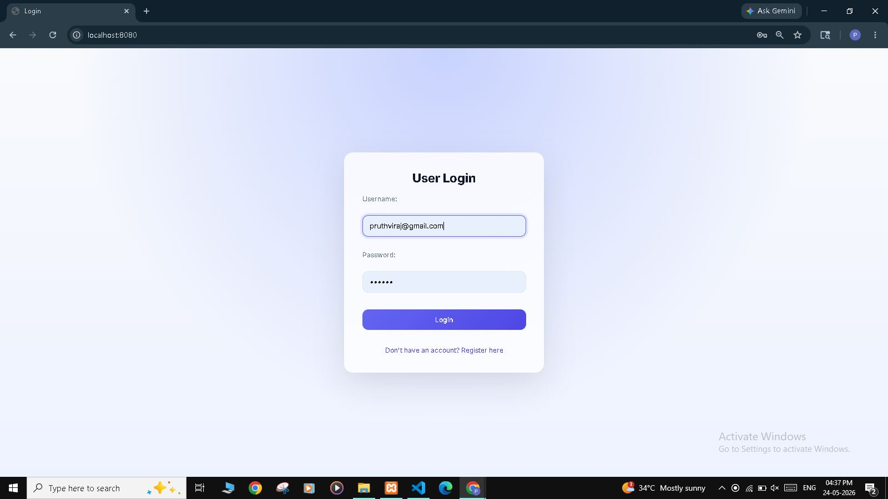
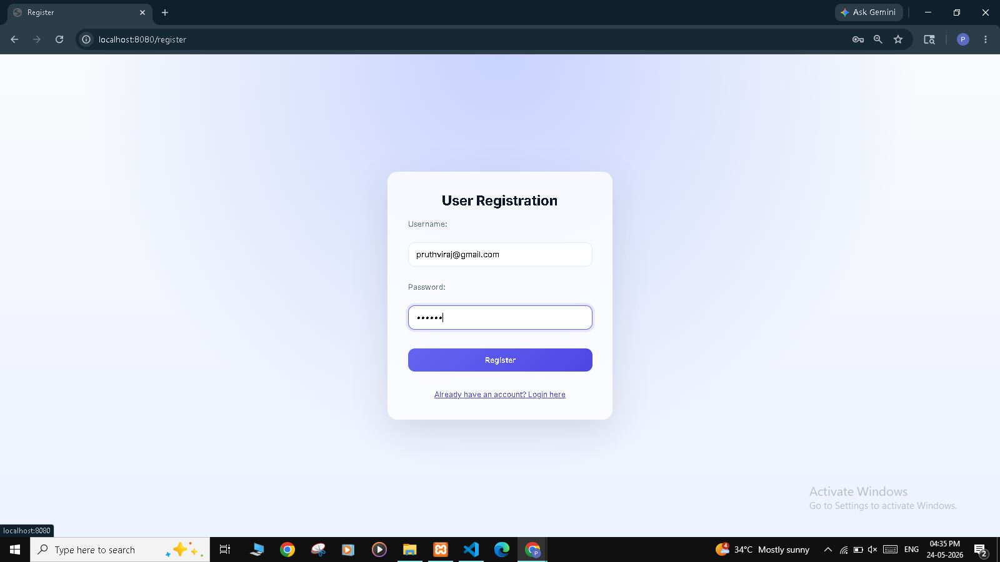
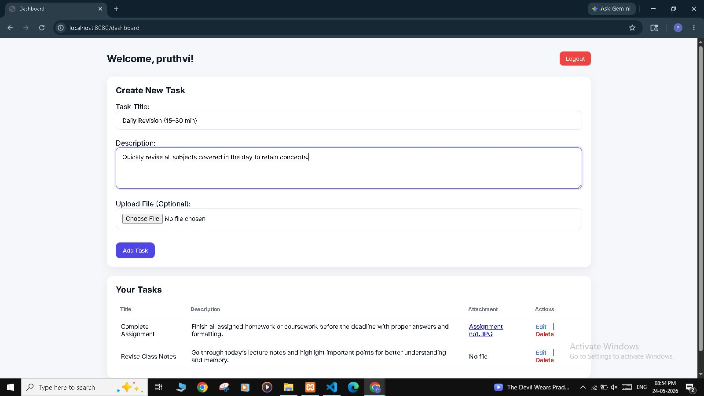
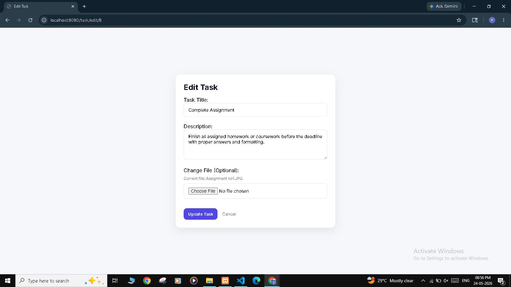

# Spring Boot Task Manager

This is my first Spring Boot project created while learning Java backend development.

A full-stack Task Manager web application built using Spring Boot, MySQL, Thymeleaf, Bootstrap, and XAMPP. Users can register, login, manage tasks, upload files, and perform CRUD operations through a clean dashboard interface.

---

## Features

- User Registration
- User Login & Logout
- Dashboard System
- Add New Tasks
- Edit Tasks
- Delete Tasks
- File Upload Support
- Task List Display
- MySQL Database Integration

---

## Technologies Used

- Java
- Spring Boot
- Spring MVC
- Spring Data JPA
- Thymeleaf
- MySQL
- Bootstrap
- HTML
- CSS
- JavaScript
- XAMPP

---

## 🔄 System Workflow

User registers into the system
User logs in using credentials
Dashboard loads user tasks
User creates new tasks
User uploads task-related files
User edits or deletes tasks
User logs out securely

---

## Project Structure

- Authentication System
- Dashboard
- CRUD Operations
- File Upload Module
- Database Connectivity

---

## Database

This project uses MySQL database through XAMPP.

---

## How to Run

1. Clone the repository

```bash
git clone <your-repository-link>
```

2. Open project in IntelliJ IDEA or VS Code

3. Create MySQL database

```sql
CREATE DATABASE task_manager;
```

4. Update database credentials in:

```properties
application.properties
```

5. Run the project

6. Open browser:

```bash
http://localhost:8080
```

---

## Screenshots

### Login Page


### Register Page


### Dashboard


### Edit Task


---

## Future Improvements

- Spring Security Integration
- Role-Based Authentication
- Responsive UI Improvements
- REST API Version
- Cloud File Storage

## Author

Pruthviraj Shivale   
